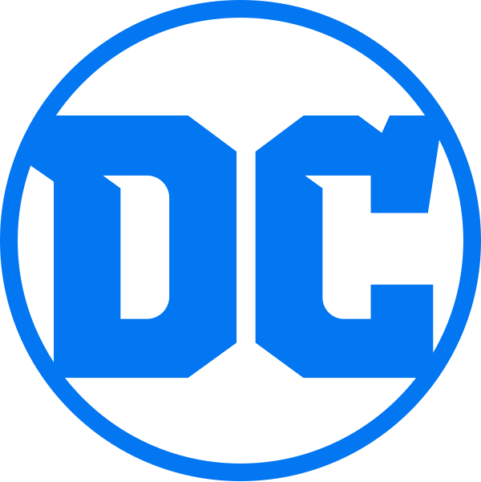

<div align="center">


# [HERO SYSTEM]


---

<div align="center">
  
  
  
  
  
</div>

---

</div>

## 🎯 What is This?

**United Hero System** is a sleek, modern web application for building and managing teams of heroes from the **DC and Marvel United** game system. Whether you're assembling the perfect Avengers squad, coordinating the X-Men, or mixing heroes across universes, this tool makes team building fast, visual, and fun.

### ✨ Features

- 🎴 **Visual Character Cards** - Beautiful card displays with character portraits and stats
- 🔍 **Advanced Filtering** - Filter by groups, sets, types, and more
- 📱 **Fully Responsive** - Works seamlessly on desktop, tablet, and mobile
- 🎨 **Modern UI** - Cyberpunk-inspired design with smooth animations
- 🔗 **Team Sharing** - Generate and share team codes
- 📊 **Excel Integration** - Easy character management via Excel spreadsheet

---

## 🚀 Quick Start

### Prerequisites

- **Node.js** 18+ 
- **pnpm** (recommended) or npm/yarn

### Installation

```bash
# Clone the repository
git clone <your-repo-url>
cd character-picker

# Install dependencies
pnpm install

# Run development server
pnpm dev
```

Open [http://localhost:3000](http://localhost:3000) in your browser.

### Build for Production

```bash
pnpm build
pnpm start
```

---

## 📝 Adding New Characters

Characters are managed through an **Excel spreadsheet** located at `public/db/United DB.xlsx`. This makes it super easy to add, update, or modify characters without touching code!

### Step 1: Open the Excel File

Navigate to `public/db/United DB.xlsx` and open it in Excel, Google Sheets, or any spreadsheet editor.

### Step 2: Add Character Data

Each character needs the following columns:

| Column Name | Description | Example | Required |
|------------|-------------|---------|----------|
| **Name** | Character's full name | `SPIDER-MAN` or `IRON MAN (CIVIL WAR)` | ✅ Yes |
| **Type** | Character type | `Hero` or `Dual Mode/Anti-Hero` | ✅ Yes |
| **Set** | Set number/name | `29` or `Core Set` | ❌ Optional |
| **Groups** | Comma-separated groups | `Spider People, Avengers` | ❌ Optional |
| **nr wild** | Number of Wild cards | `3` | ✅ Yes |
| **nr heroics** | Number of Heroic cards | `5` | ✅ Yes |
| **nr attacks** | Number of Attack cards | `4` | ✅ Yes |
| **nr movements** | Number of Movement cards | `2` | ✅ Yes |

### Step 3: Add Character Portrait

1. **Prepare your image:**
   - Format: `.webp`, `.jpg`, or `.png` (`.webp` recommended)
   - Recommended size: 400x600px or similar portrait ratio
   - **Name format:** `CHARACTERNAME.ext` (e.g., `SPIDER_MAN.webp`)

2. **Naming conventions:**
   - Replace spaces with underscores: `Iron Man` → `IRON_MAN.webp`
   - Use **UPPERCASE** for all characters
   - For variants: `IRON_MAN_(CIVIL_WAR).jpg`
   - For Dual Mode/Anti-Hero types: `MAGNETO_Villain.jpg` (add `_Villain` suffix)
   - **No numbers** (like `_29`) - these are ignored
   - **No `_Back` suffix** - all images use simple naming

3. **Save the image:**
   - Place the file in `public/portraits/`
   - The system will automatically match images to characters based on name

### Step 4: Image Matching Examples

The system matches images directly to character names. Here are some examples:

| Character Name in Excel | Image Filename | Match? |
|------------------------|----------------|--------|
| `SPIDER-MAN` | `SPIDER_MAN.webp` | ✅ Yes |
| `IRON MAN (CIVIL WAR)` | `IRON_MAN_(CIVIL_WAR).jpg` | ✅ Yes |
| `BATMAN (CLASSIC)` | `BATMAN_(CLASSIC).webp` | ✅ Yes |
| `MAGNETO` (Type: Dual Mode/Anti-Hero) | `MAGNETO_Villain.jpg` | ✅ Yes |
| `LOKI [HERO]` | `LOKI.webp` | ✅ Yes (tags like [HERO] are ignored) |
| `SPIDER-MAN 2099 (ORIGINAL SUIT)` | `SPIDER_MAN_2099_(ORIGINAL_SUIT).jpg` | ✅ Yes |

### Step 5: Verify Your Character

1. Save the Excel file
2. Restart the development server (`pnpm dev`)
3. Navigate to the character selector
4. Your new character should appear!

---

## 🎨 Character Groups

Characters can belong to multiple groups. Available groups include:

- **Avengers** - Earth's mightiest heroes
- **X-Men** - Mutant heroes and anti-heroes  
- **Spider People** - Web-slingers across the multiverse
- **Bat Family** - Gotham's protectors
- **DC** - General DC Universe characters

Group icons are located in `public/icons/groups/` and are automatically displayed on character cards.

---

## 📊 Character Stats Explained

Each character has four stat types represented by icons:

| Icon | Stat | Color | Description |
|------|------|-------|-------------|
| ⬆️ | **Wild** | Gray | Wild cards (flexible) |
| ⚡ | **Heroics** | Yellow | Heroic action cards |
| 💥 | **Attacks** | Red | Attack action cards |
| 🍃 | **Movements** | Green | Movement action cards |

These stats are displayed on each character card and help you build balanced teams.

---

## 🏗️ Project Structure

```
character-picker/
├── app/                    # Next.js app directory
│   ├── api/               # API routes
│   ├── character-selector/ # Character selection page
│   ├── assemble/          # Team assembly page
│   └── menu/              # Main menu
├── components/             # React components
│   ├── character-card.tsx  # Desktop character card
│   ├── character-filters.tsx # Filter components
│   └── ui/                # UI components (shadcn/ui)
├── lib/                    # Utility functions
│   └── load-characters.ts  # Excel loader
├── public/
│   ├── db/                # Excel database
│   ├── portraits/         # Character images
│   └── icons/             # Icons and group images
└── types/                 # TypeScript types
```

---

## 🛠️ Tech Stack

- **Framework:** [Next.js 14](https://nextjs.org/) (App Router)
- **Language:** [TypeScript](https://www.typescriptlang.org/)
- **Styling:** [Tailwind CSS](https://tailwindcss.com/)
- **UI Components:** [shadcn/ui](https://ui.shadcn.com/)
- **Data Processing:** [SheetJS (xlsx)](https://sheetjs.com/)
- **Package Manager:** [pnpm](https://pnpm.io/)

---

## 📸 Screenshots

<div align="center">

### Boot Sequence
*Cyberpunk-inspired startup animation*

### Character Selector
*Browse and filter through all available characters*

### Team Builder
*Assemble your perfect team with drag-and-drop*

</div>

---

## 🤝 Contributing

Want to add more characters or improve the app?

1. Add characters via the Excel file (see [Adding New Characters](#-adding-new-characters))
2. Add character portraits to `public/portraits/`
3. Test your changes locally
4. Submit a pull request!

---

<div align="center">

**Built with ❤️ for the United Game System community**

*Assemble your team. Save the day.*

</div>
